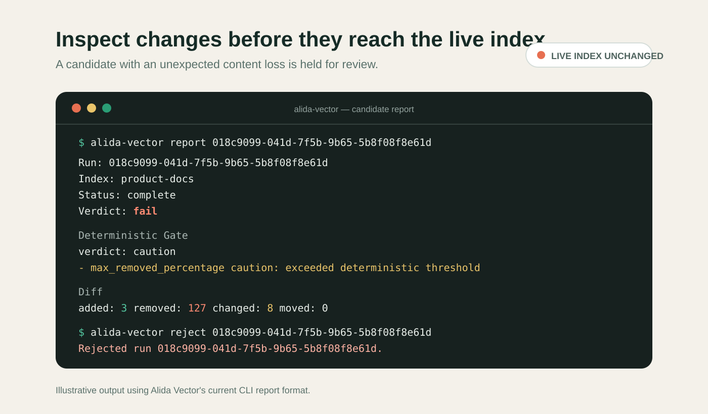

# Alida Vector

Alida Vector is a tool for building and automatically refreshing vector-backed knowledge bases. It crawls configured sources, extracts content and metadata, chunks content for embedding, and stores the result in a vector database. Before promoting a candidate index to a live index, it validates the changes using an LLM to catch quality issues.

The main use case is retrieval-augmented generation (RAG): keeping a chatbot or assistant supplied with current, searchable context from external sources.

Project website: [alida.dev](https://alida.dev/)

## Project status

Alida Vector 0.1 is an early public preview. I built the first version for my own use and am using it in production, but the public project is still taking shape. Configuration and CLI details may change while it develops into a reusable open-source tool.

The current storage backend is PostgreSQL with pgvector. Embeddings can use OpenAI, Azure OpenAI, or Vertex AI. LLM verification supports OpenAI, Azure OpenAI, and Vertex AI. A noop embedding provider is available for crawl and extraction tuning runs.

The project is written in Clojure.

## Quick start

The included Docker Compose example crawls two local HTML documents into
PostgreSQL with pgvector. It uses placeholder embeddings and disables paid LLM
verification, so it needs no API keys:

```bash
git clone https://github.com/fmw/alida-vector.git
cd alida-vector
docker compose -f examples/quickstart/compose.yml run --rm alida migrate --config /config/alida.yml
docker compose -f examples/quickstart/compose.yml run --rm alida crawl --config /config/alida.yml
docker compose -f examples/quickstart/compose.yml run --rm alida runs --config /config/alida.yml
```

Use the run ID printed by `crawl` or `runs` to inspect the stored report:

```bash
docker compose -f examples/quickstart/compose.yml run --rm alida report RUN_ID --config /config/alida.yml
```

The quick start demonstrates discovery, extraction, chunking, persistence,
deterministic checks, and reports. Its noop embeddings are deliberately not
searchable or activatable. Configure a real embedding provider and enable LLM
verification before building a production index. Remove the example database
when finished with `docker compose -f examples/quickstart/compose.yml down -v`.

## How it works

1. Discover documents from configured external sources.
2. Fetch pages or files.
3. Extract content and metadata.
4. Clean and normalize content.
5. Split large documents into embedding-sized chunks.
6. Create or reuse embeddings for changed chunks.
7. Store documents and vectors in the vector database.
8. Compare the new index with the previous live index.
9. Run deterministic diff gates and optional LLM verification on the differences.
10. Promote the validated result to the live index, automatically or manually.

## Data sources

- crawlable websites, using sitemaps and regular HTML parsing
- Jira Service Management knowledge bases, using a fast API-backed crawler
- JavaScript-heavy sites, using a generic headless-browser crawler
- files and structured content exports from local paths, S3, and GCS, including JSON-to-HTML extraction

## Automate, but verify

Scraping data from external sources often introduces subtle problems: pages disappear, irrelevant text leaks into content, JavaScript rendering breaks, and sites change structure.

Alida Vector uses an LLM verification step to validate scraped data before a candidate index is promoted to the live index. The goal is to automate routine refreshes while catching obvious crawl, extraction, or indexing problems before users are exposed to bad data.



_Illustrative output using the current CLI report format: the suspicious
candidate is rejected while the live index remains unchanged._

## Running it

Alida Vector is designed to run as a scheduled job, such as a Docker container running on Kubernetes.

For crawl cleanup and extraction tuning, see [Crawl Tuning](docs/tuning.md).

For local, S3, and GCS file-source configuration, see [File Sources](docs/file-sources.md).

For real-bucket validation workflows, see [Manual Fixture Verification](docs/manual-fixtures.md).

For client SQL against activated indexes, see [Live Query Contract](docs/live-query-contract.md).

For development-time verifier checks with intentionally unsafe local content, see [LLM Verification Fixture](docs/llm-verification-fixture.md).

For container and Kubernetes deployment notes, see [Deployment](docs/deployment.md).

## Contact

If you're using Alida Vector or have any questions, I'd love to hear from you. You can make a GitHub issue or reach out through fmw@vix.io.

## License

MIT

## History

Alida Vector is a continuation of [Alida](https://github.com/fmw/alida/), a Clojure and Apache Lucene project I built for a presentation at EuroClojure 2012 in London.

The project is named after [my grandmother](https://www.youtube.com/watch?v=UyGlPaDqgpI), who has always been a great archivist.
